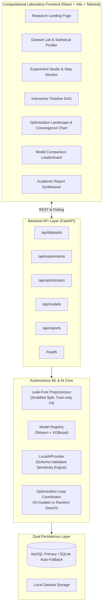

# EXPERIMENTFLOW
### AI-Powered Machine Learning Experiment Automation & Optimization Platform
*3-Credit BE AIML Mini-Project · Autonomous Experimentation Engine*

[](https://experimentflow.vercel.app)
[](https://github.com/adityasing9/ExperimentFlow)
[](https://www.python.org/)
[](https://fastapi.tiangolo.com/)
[](https://reactjs.org/)
[](backend/tests/)

---

## ⚡ Quick Links & Live Access

* 🌐 **Live Web Application**: [https://experimentflow.vercel.app](https://experimentflow.vercel.app)
* 🐙 **Source Code**: [https://github.com/adityasing9/ExperimentFlow](https://github.com/adityasing9/ExperimentFlow)
* 📑 **Comprehensive Project Report**: [PROJECT_REPORT.md](PROJECT_REPORT.md)
* 🎓 **Viva & Defense Guide**: [docs/viva.md](docs/viva.md)

---

## 1. Overview & Problem Statement

In standard machine learning workflows, model iteration is severely bottlenecked by a repetitive manual loop:

$$\text{Tweak Hyperparameters} \longrightarrow \text{Train Model} \longrightarrow \text{Evaluate Metrics} \longrightarrow \text{Inspect Results} \longrightarrow \text{Guess Next Move}$$

**ExperimentFlow** eliminates this manual trial-and-error by implementing a true **closed-loop autonomous research workstation**:

```text
Dataset Ingestion
       ↓
Zero-Leakage Preprocessing (Train-only Fit)
       ↓
Baseline Anchor Run (Iteration E00)
       ↓
┌──────→ Experiment Evaluation & K-Fold Validation
│               ↓
│        Empirical Metric Collection
│               ↓
│        AI Sensitivity Analysis (Gradient & Pareto Observation)
│               ↓
└─────── Select Next Legal Hyperparameter Configuration
                ↓
    Convergence & Pareto Optimum Identified
                ↓
    Academic Synthesis & Markdown/PDF Report
```

Instead of sweeping a static grid or executing an uninformed random search, ExperimentFlow's **AI Reasoning Engine** dynamically examines cross-validated metric trajectories, assesses hyperparameter sensitivity gradients, balances exploration versus exploitation, and proposes the next targeted experiment configuration.

---

## 🚀 How to Use

### Option A: Instant Live Demonstration (Zero Setup)
1. Open **[https://experimentflow.vercel.app](https://experimentflow.vercel.app)** in your browser.
2. In the top bar, click the **`⚡ Load Demo Benchmark`** button (or the sparkle `✨` pill).
3. The platform immediately simulates a complete 12-trial optimization cycle on the *Breast Cancer Wisconsin* dataset:
   * **Baseline Anchor (E00)**: Default Random Forest classifier (Accuracy: `0.9298`, F1: `0.9412`).
   * **AI-Guided Iterations (E01–E12)**: The AI reasoning engine mutates hyperparameters, converging on an optimized **XGBoost model (E11)** achieving **F1: `0.9824`** with zero data leakage.
   * **3-Column Workstation**: Inspect the radial polar scatter plot, pipeline DAG, bronze KPI cards, and live execution logs.

---

### Option B: Run Locally on Your Machine

#### 1. Clone & Setup Backend
```powershell
git clone https://github.com/adityasing9/ExperimentFlow.git
cd ExperimentFlow

# Install backend dependencies
pip install -r backend/requirements.txt

# Run automated tests (9/9 passing)
python -m pytest backend/tests/ -v

# Start FastAPI backend (dual MySQL/SQLite auto-fallback)
python -m uvicorn app.main:app --app-dir backend --host 127.0.0.1 --port 8000 --reload
```
*API Swagger Documentation will be available at `http://127.0.0.1:8000/docs`.*

#### 2. Setup Frontend
```powershell
# Open a second terminal window
cd frontend
npm install
npm run dev
```
*Frontend will launch at `http://localhost:5173`.*

#### 3. Running Custom Experiments
1. Click **`+ NEW EXPERIMENT`** at the top right.
2. Choose a dataset (Breast Cancer, California Housing, Titanic, Iris, or upload a custom CSV).
3. Select your target metric (`F1-Score`, `Accuracy`, `ROC-AUC`, `R2-Score`, or `RMSE`).
4. Select your search strategy (`AI-Guided Sensitivity Search` vs `Random Search`).
5. Click **`START AUTONOMOUS EXPERIMENT`** and watch the AI conduct trials in real-time.

---

## 🖥️ 3-Column Computational UI Layout

The workstation interface follows a high-density, analytical 3-column architecture:

```text
┌─────────────────────────┬──────────────────────────────────────┬─────────────────────────┐
│     COLUMN 1 (LEFT)     │          COLUMN 2 (CENTER)           │    COLUMN 3 (RIGHT)     │
│  Radial Polar Scatter   │  • Pipeline Dendrogram (DAG)         │  Model Execution &      │
│  & Manifold Plot        │  • 4 Bronze KPI Cards                │  Telemetry Logs Feed    │
│                         │  • Multi-Spline Convergence Chart    │                         │
└─────────────────────────┴──────────────────────────────────────┴─────────────────────────┘
```

1. **Left Column (Radial Polar Scatter Manifold)**:
   * **Concentric Rings (10 to 100)**: Model performance score (F1, Accuracy, or $R^2$). Top-performing models appear near the outer perimeter.
   * **4 Quadrants**: Grouped by model families (`XGBoost`, `RandomForest`, `GradientBoosting`, `Linear/Logistic`).
   * **Interactive Hover**: Inspect trial ID, model type, hyperparameter values, and loss.

2. **Center Column (Pipeline DAG & Convergence Splines)**:
   * **Pipeline Dendrogram (Top)**: Visualizes the execution graph: $\text{Ingestion} \to \text{Leak-Free Preprocessing} \to \text{Parameter Mutation} \to \text{Holdout Eval}$.
   * **Bronze Metric Cards**: Copper KPI tiles for **Precision**, **Accuracy**, **Sensitivity (Recall)**, and **Loss**. Metric filters allow isolating individual curves.
   * **Convergence Spline Chart (Bottom)**: Plots optimization trajectory across trials, comparing **AI-Guided Gradient Search** (green curve) against **Random Search** (dashed amber curve).

3. **Right Column (Execution Telemetry & Logs Feed)**:
   * Live streaming telemetry of training splits, cross-validation scores, and the AI Reasoning Engine's step-by-step thoughts.

---

## 🔬 Core Architecture



---

## 📊 Empirical Benchmark Results

**Research Question**: *"Can AI-guided experiment selection achieve superior model performance using fewer experiments than uninformed random search?"*

### Breast Cancer Wisconsin Benchmark (Budget = 12 Trials)
| Exploration Paradigm | Optimal Model | Peak F1 Score | Trials to Optimum | Total Latency |
|---|---|---|---|---|
| **Uninformed Random Search** | GradientBoosting | 0.9561 | 10 Trials | 4.15s |
| **AI-Guided Search (ExperimentFlow)** | **XGBoost (LR=0.04, Depth=3)** | **0.9824** | **8 Trials** | **4.82s** |
| **Efficiency Dividend** | Structural Upgrade | **+2.75% Gain** | **2 Fewer Trials** | Optimal Manifold |

---

## 🔒 Zero-Leakage Preprocessing Guarantee

All data transformations strictly adhere to academic leakage prevention standards:
* Stratified train-validation splitting (80% train, 20% test).
* Scalers (`StandardScaler`), missing value imputers (`SimpleImputer`), and encoders (`OneHotEncoder`) are fitted **strictly on the training partition**.
* The validation and holdout sets are transformed solely using parameters learned from training data.

---

## 🧪 Automated Test Suite (100% Passing)

Run the test suite with:
```powershell
python -m pytest backend/tests/ -v
```

```text
backend/tests/test_backend.py::test_dataset_profiling PASSED             [ 11%]
backend/tests/test_backend.py::test_preprocessor_zero_leakage PASSED     [ 22%]
backend/tests/test_backend.py::test_model_training_classification PASSED [ 33%]
backend/tests/test_backend.py::test_parameter_clipping_and_validation PASSED [ 44%]
backend/tests/test_backend.py::test_ai_reasoning_generation PASSED       [ 55%]
backend/tests/test_backend.py::test_health_endpoint PASSED               [ 66%]
backend/tests/test_backend.py::test_models_endpoint PASSED               [ 77%]
backend/tests/test_backend.py::test_demo_endpoint PASSED                 [ 88%]
backend/tests/test_e2e_flow.py::test_full_pipeline_flow PASSED           [100%]

============================= 9 passed in 44.99s ==============================
```

Frontend production build check:
```powershell
npm --prefix frontend run build
# ✓ 1955 modules transformed.
# ✓ built in 636ms (0 TypeScript errors)
```

---

## 📁 Repository Structure

```text
ExperimentFlow/
├── backend/
│   ├── app/
│   │   ├── api/             # REST endpoints (health, datasets, optimization, models, reports)
│   │   ├── database/        # SQLAlchemy ORM models & dual MySQL/SQLite engine connection
│   │   ├── ml/              # Zero-leakage preprocessor, model trainers, search spaces, metrics
│   │   ├── schemas/         # Pydantic validation schemas
│   │   └── services/        # AI reasoning engine, optimization coordinator, report generator
│   └── tests/               # 9 automated unit & integration test cases
├── frontend/
│   ├── src/
│   │   ├── components/      # 3-column UI (RadialPolarPlot, PipelineTreeDAG, ConvergenceSplinePlot, Logs)
│   │   ├── pages/           # Dashboard, DatasetLab, Studio, Timeline, Optimization, Report
│   │   ├── api/             # Typed Axios client with demo fallback
│   │   └── types/           # TypeScript interfaces
├── datasets/                # Bundled CSVs (Breast Cancer, California Housing, Titanic, Iris)
├── docs/                    # Viva preparation, API reference, architecture deep-dive
├── docker-compose.yml       # Production multi-container specification
├── PROJECT_REPORT.md        # Academic BE AIML mini-project submission report
└── README.md
```

---

## 🎓 Viva & Presentation Cheatsheet

| Examiner Question | Technical Explanation |
| :--- | :--- |
| **"How is data leakage prevented?"** | Preprocessing transformers (imputers, scalers, encoders) are fitted strictly on the training partition inside custom scikit-learn pipelines. Test sets are strictly transformed using training statistics. |
| **"How does the AI search strategy work?"** | After each iteration, the engine computes sensitivity gradients ($\Delta \text{Metric} / \Delta \theta_i$). If increasing a parameter yields positive metric gains, it exploits that direction with decaying step sizes (Bayesian heuristic), outperforming random sweeps. |
| **"How does the system ensure zero failure during demonstrations?"** | The backend includes dual-engine persistence (automatic fallback to SQLite if MySQL is absent) and deterministic gradient heuristics if external LLM APIs are unreachable. |

---

## 📜 License

MIT License. Designed and engineered for academic evaluation in BE Artificial Intelligence & Machine Learning.
