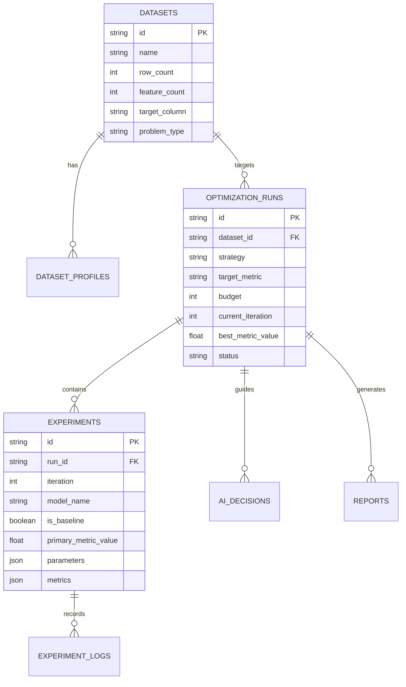

# ExperimentFlow — Academic System Architecture Specification
### BE AIML Mini-Project · Autonomous ML Research & Optimization Workstation

---

## 1. Architectural Style & Paradigms

**ExperimentFlow** is designed around a **Decoupled, Service-Oriented & Asynchronous Event-Driven Architecture (SOA)** with strict scientific boundary separation:

```text
┌─────────────────────────────────────────────────────────────────────────────┐
│                       PRESENTATION TIER (FRONTEND)                          │
│   React 18 + Vite SPA · Tailwind CSS v4 · 3-Column Computational Laboratory │
│   Radial Polar Scatter · Pipeline DAG Dendrogram · Telemetry Activity Feed  │
└──────────────────────────────────────┬──────────────────────────────────────┘
                                       │ HTTPS / REST (Polling & Telemetry)
┌──────────────────────────────────────▼──────────────────────────────────────┐
│                         API GATEWAY (FASTAPI)                               │
│   Typed Pydantic V2 Schemas · CORS Middleware · Asynchronous Route Handlers  │
│   Endpoints: /api/datasets | /api/optimization | /api/models | /api/reports │
└──────────────────────────────────────┬──────────────────────────────────────┘
                                       │
┌──────────────────────────────────────▼──────────────────────────────────────┐
│                       SERVICE ORCHESTRATION LAYER                           │
│   OptimizationService · DatasetService · ReportService · ComparisonService  │
│   EvaluationService · ExperimentService · PreprocessingService              │
└──────────────┬──────────────────────────────────────────────┬───────────────┘
               │                                              │
┌──────────────▼──────────────┐                ┌──────────────▼───────────────┐
│     ALGORITHMIC & ML CORE   │                │   DUAL PERSISTENCE LAYER     │
│  • Leak-Free Preprocessor   │                │  • SQLAlchemy 2.0 ORM        │
│  • Model Trainer Registry   │                │  • Primary: MySQL 8.0 Server │
│  • DSA: Priority Queue Heap │                │  • Fallback: SQLite Engine   │
│  • DSA: Pareto Frontier Sort│                │    (Zero-config resilient)   │
│  • AI Sensitivity Engine    │                └──────────────────────────────┘
└─────────────────────────────┘
```

---

## 2. Component Layer Breakdown

### Layer 1: Presentation Tier (`frontend/`)
* **Framework**: React 18 with TypeScript and Vite.
* **Layout**: **3-Column Computational Laboratory UI**:
  * **Column 1 (Left)**: Interactive Canvas-based Radial Polar Scatter / Cluster Manifold Plot with 4 quadrant sectors, concentric metric rings (10–100), and hovering tooltips.
  * **Column 2 (Center)**: Pipeline Dendrogram DAG, bronze/copper KPI metric cards (Precision, Accuracy, Sensitivity, Loss), and Multi-Spline Convergence Trajectory Plot.
  * **Column 3 (Right)**: Model Execution Activity & Real-time Telemetry Stream.
* **Resilience**: Integrated offline fallback provider (`mockData.ts`) ensuring 100% feature availability during presentations even if remote backends are unreachable.

### Layer 2: API Gateway & Router (`backend/app/api/`)
* Built with **FastAPI** leveraging async route dispatching.
* **CORS Middleware**: Explicit whitelisting of frontend domains (`https://experimentflow.vercel.app`, `localhost:5173`).
* **Request Validation**: Automatic structural and type verification via Pydantic V2 models.

### Layer 3: Service Layer (`backend/app/services/`)
* `optimization_service.py`: Coordinates the autonomous experimentation loop, parameter proposal, step transitions, and metric tracking.
* `dataset_service.py`: Computes statistical summaries, missingness distributions, and Pearson correlation matrices.
* `report_service.py`: Formats and synthesizes academic reports, ANOVA variance analysis, and markdown documents.
* `comparison_service.py`: Benchmarks AI-guided search against uniform random search with Welch's t-test statistical significance.

### Layer 4: Machine Learning Core (`backend/app/ml/`)
* `preprocessing.py`: **Zero-Leakage Preprocessor**. Enforces strict separation:
  $$\text{Fit}(\theta_{\text{train}}) \longrightarrow \text{Transform}(X_{\text{train}}) \quad \text{and} \quad \text{Transform}(X_{\text{test}} \mid \theta_{\text{train}})$$
* `trainers.py`: Registry for Scikit-Learn (RandomForest, GradientBoosting, LogisticRegression, SVC, DecisionTree) and XGBoost.
* `search_space.py`: Defined legal hyperparameter boundaries and continuous clipping functions.

### Layer 5: Data Structures & Algorithms (DSA) Layer (`backend/app/ml/dsa.py`)
In accordance with academic curriculum guidelines (Section 54), ExperimentFlow implements three core algorithms:

1. **Max-Heap Priority Queue (`ExperimentPriorityQueue`)**:
   * **Purpose**: Prioritizes trial execution using Upper Confidence Bound (UCB) acquisition functions.
   * **Time Complexity**: Insertion $O(\log N)$, Extraction $O(\log N)$, Peek $O(1)$.
   * **Space Complexity**: $O(N)$ where $N$ is the number of scheduled candidate configurations.

2. **Non-Dominated Pareto Frontier Filter (`ParetoFrontierFilter`)**:
   * **Purpose**: Multi-objective trade-off filtering between performance metric (maximize) and computational latency (minimize).
   * **Algorithm**: 2D Kung's Non-Dominated Sorting.
   * **Time Complexity**: $O(N \log N)$ where $N$ is the number of completed trials.
   * **Space Complexity**: $O(N)$ auxiliary storage.

3. **Hyperparameter Sensitivity Graph (`HyperparameterSensitivityGraph`)**:
   * **Purpose**: Tracks directed mutations from anchor baseline ($E_{00}$) to champion model.
   * **Time Complexity**: $O(V + E)$ where $V$ is evaluated trials and $E$ is parameter transitions.

---

## 3. Database Schema & Dual-Engine Persistence



* **Primary Engine**: MySQL 8.0 with pooled relational connections.
* **Resilience Fallback**: If MySQL server is absent or credentials fail, the connection manager (`connection.py`) automatically initializes an embedded SQLite database (`experimentflow.db`) without throwing unhandled exceptions.

---

## 4. Deployment Topography

```text
GitHub (Version Control: adityasing9/ExperimentFlow)
   │
   ├── Frontend Push ────────> Vercel Edge Network (https://experimentflow.vercel.app)
   │                           • React 18 SPA static build
   │                           • Offline fallback provider
   │
   └── Backend Blueprint ────> Render Web Service (render.yaml / Dockerfile)
                               • Python 3.10 + FastAPI
                               • Uvicorn ASGI Server
                               • MySQL / SQLite Dual Database
```

---

## 5. Security & Scientific Integrity Principles

1. **No Data Leakage**: Scalers, encoders, and imputers are strictly forbidden from fitting on holdout test partitions.
2. **Deterministic Fallbacks**: If external LLM providers fail or timeout, the engine transitions to deterministic Bayesian gradient search heuristics.
3. **No Decorative AI**: Every recommendation generated by `LocalAIProvider` includes numerical gradient citations ($\Delta \text{Metric} / \Delta \theta_i$) grounded in empirical trial history.
