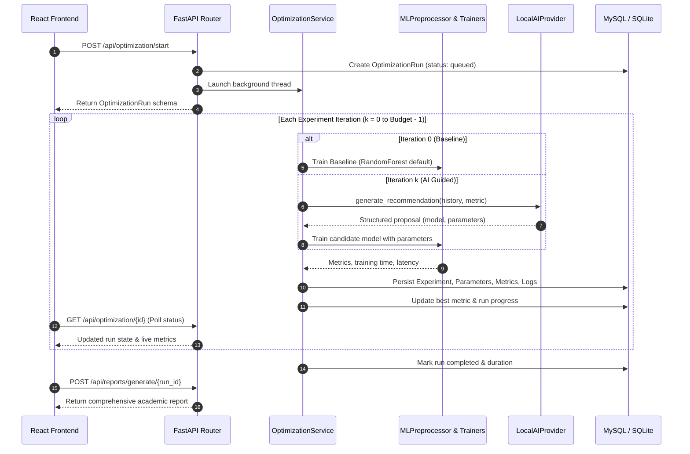

# ExperimentFlow — Architecture Documentation

This document describes the design, execution flow, and structural design patterns utilized in **ExperimentFlow**.

---

## 1. Architectural Style

ExperimentFlow adopts a **Decoupled Client-Server & Asynchronous Service-Oriented Architecture (SOA)**:
- **Client Tier**: Single Page Application built on React 18, TypeScript, and Vite styled with the custom "Computational Laboratory" Tailwind design system.
- **API Gateway & Orchestration**: FastAPI service exposing typed REST endpoints with Pydantic V2 schema validation and asynchronous task dispatching.
- **Execution & ML Core**: Decoupled Python service layer separating data ingestion, leak-free preprocessing, model fitting, and local AI reasoning.
- **Persistence Tier**: Relational storage using SQLAlchemy ORM with dual-engine capability (MySQL 8.0 primary, SQLite local fallback).

---

## 2. Core Execution Lifecycle

