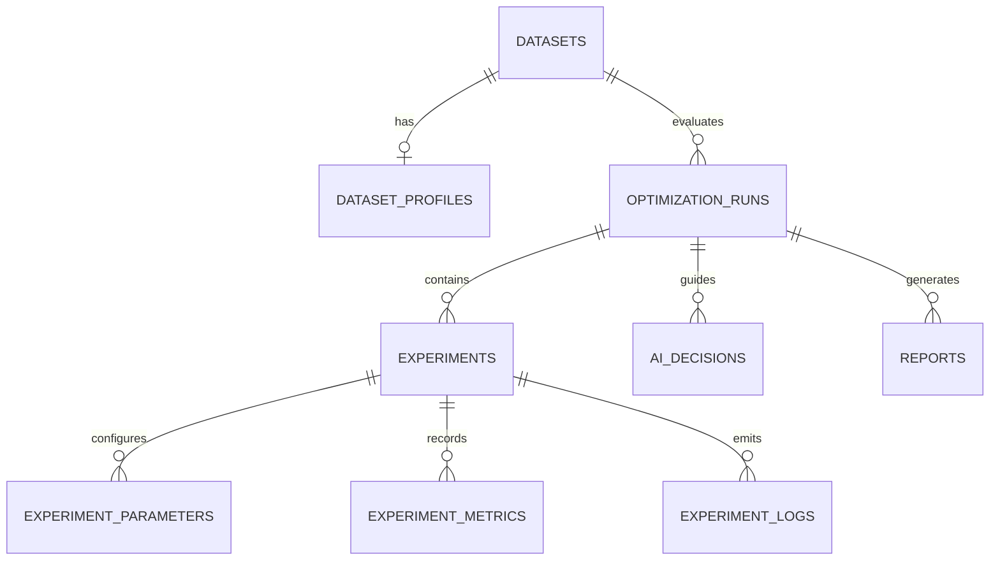

# ExperimentFlow — Database Schema & Data Dictionary

The persistence layer uses SQLAlchemy 2.0 ORM with strict relational constraints, foreign keys, and indexes.

---

## 1. Entity-Relationship Model

---

## 2. Table Specifications

### 2.1 `datasets`
| Column | Type | Constraints | Description |
|---|---|---|---|
| `id` | VARCHAR(36) | PK | UUID identifier |
| `name` | VARCHAR(100) | NOT NULL | Human-readable dataset name |
| `file_path` | VARCHAR(255) | NOT NULL | Path to raw CSV storage |
| `source_type` | VARCHAR(20) | DEFAULT 'sample' | 'sample' or 'upload' |
| `row_count` | INT | NOT NULL | Number of samples |
| `feature_count` | INT | NOT NULL | Number of feature columns |
| `target_column` | VARCHAR(100) | NULLABLE | Column to predict |
| `problem_type` | VARCHAR(30) | NULLABLE | Classification or regression |
| `created_at` | DATETIME | DEFAULT utcnow | Ingestion timestamp |

### 2.2 `dataset_profiles`
| Column | Type | Constraints | Description |
|---|---|---|---|
| `id` | VARCHAR(36) | PK | UUID identifier |
| `dataset_id` | VARCHAR(36) | FK -> datasets.id | Parent dataset |
| `summary_json` | JSON | NOT NULL | Missing counts, dtypes, memory |
| `correlations_json` | JSON | NULLABLE | Pearson correlation matrix |
| `class_distribution_json` | JSON | NULLABLE | Frequency distribution of classes |
| `feature_stats_json` | JSON | NULLABLE | Moments (mean, std, min, median, max) |

### 2.3 `optimization_runs`
| Column | Type | Constraints | Description |
|---|---|---|---|
| `id` | VARCHAR(36) | PK | UUID identifier |
| `dataset_id` | VARCHAR(36) | FK -> datasets.id | Evaluated dataset |
| `name` | VARCHAR(150) | NOT NULL | Name of the optimization run |
| `strategy` | VARCHAR(30) | NOT NULL | 'ai_guided' or 'random_search' |
| `target_metric` | VARCHAR(50) | NOT NULL | f1, accuracy, roc_auc, r2, rmse |
| `budget` | INT | DEFAULT 10 | Target experiment count |
| `current_iteration` | INT | DEFAULT 0 | Completed trials count |
| `status` | VARCHAR(30) | DEFAULT 'queued'| queued, running, completed, failed, cancelled |
| `best_metric_value`| FLOAT | NULLABLE | Highest achieved score |
| `best_experiment_id`| VARCHAR(36)| NULLABLE | Experiment ID holding optimum |
| `total_duration_sec`| FLOAT | DEFAULT 0.0 | Overall elapsed runtime in seconds |

### 2.4 `experiments`
| Column | Type | Constraints | Description |
|---|---|---|---|
| `id` | VARCHAR(36) | PK | UUID identifier |
| `optimization_run_id`| VARCHAR(36)| FK -> optimization_runs.id | Parent run |
| `iteration` | INT | NOT NULL | Chronological trial index (0=baseline) |
| `model_name` | VARCHAR(50) | NOT NULL | Architecture family name |
| `is_baseline` | BOOLEAN | DEFAULT FALSE | Flag indicating default baseline trial |
| `status` | VARCHAR(30) | NOT NULL | queued, running, completed, failed |
| `training_time_sec` | FLOAT | DEFAULT 0.0 | Seconds elapsed during `.fit()` |
| `inference_time_ms` | FLOAT | DEFAULT 0.0 | Milliseconds elapsed during `.predict()` |
| `primary_metric_value`| FLOAT | NULLABLE | Target metric achieved |
